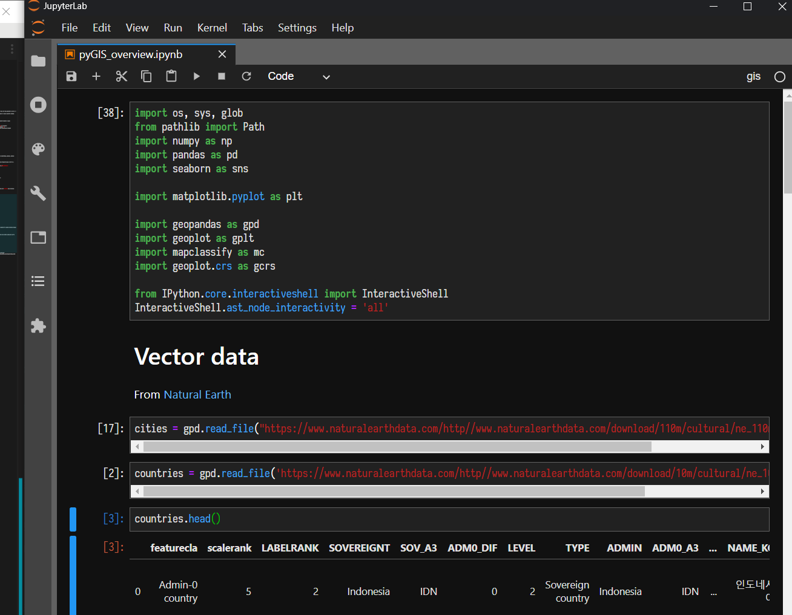

<style type="text/css">
  .reveal p {
    text-align: left;
    font-size: 0.9em !important;
  }
  .reveal ul {
    display: block;
  }
  .reveal ol {
    display: block;
  }
</style>

```{r setup, include=FALSE}
library(LalRUtils)
libreq(tidyverse, knitr, knitcitations)
opts_chunk$set(cache=TRUE, warning = FALSE)
```

# Introduction

## Geospatial Data in the Social Sciences

- Many topics in the social sciences (Economics, Political Science, Sociology, etc) deal with data generated by units in (usually geographical) space
- Social scientists have paid (relatively) little attention to studying spatial aspects of social scientific problems because of (among other things) computational challenges
- This is beginning to change

## Why use spatial data?

- most objects of interest in empirical social science have (either implicit or explicit) location in space
  - **inferential challenges**
    - SUTVA (Stable Unit Treatment Value Assumption) violations
    - Correlated unobservables (and thus standard errors) [@Kelly2019-zs]
  - but also **research design opportunities** (@kudamatsu2018gis, @donaldson2016view for overview)
    - spatial merges that allow for richer set of controls (weather, rainfall, topography etc)
    - use of administrative boundaries as source of variation (geographical regression discontinuity designs)
    - use of remote sensing data (e.g. nightlights, LANDSAT)

# The Geospatial analysis toolkit

## Overview

### Proprietary tools
- ArcGIS (~ Excel of GIS)
  + Pros: GUI, good documentation, technical consulting has you covered
  + Cons: GUI, \$\$\$, non-automatable

### Open-Source Tools
- QGIS (~ OpenOffice of GIS)
  + Pros: All of the above + Free
  + Cons: GUI

- Python / R Spatial Ecosystem
  + Pros: Free, automatable, rapidly developed
  + Cons: Steep(er) Learning Curve

## Aside on automation

- Computational social science workflows involve a number of judgement calls in data input/coding, analysis, numerous robustness checks
- This means your data prep/analysis pipeline should be as streamlined
  as possible to accommodate suggested changes / robustness checks
  from colleagues, referees, advisors
- Future you will thank you for putting in the extra effort so you don't have to click through 20 menus in GIS for a robustness check

For a more thorough case for automation and tips to get started, see @Gentzkow2014-wp, @healy2016plain

## This Talk

Overview of GIS Data structures and Geospatial
toolkit *in Python* based on my own trial-and-error learning,
@darribas_gds18

Major packages:

- `geopandas` - geospatial analysis tools built on top of widely used pandas library
- `rasterio` - interface with Raster Data
- `pysal` - spatial econometrics (and much more)
- `rasterstats` - summary statistics of raster datasets for vector features

[underlying C and python libraries - `fiona`, `shapely`, `GDAL`]

## Equivalent tools available in R

- `sf` (stands for Simple Features) for general spatial data needs + spatial interface with tidyverse data structures
- `stars` (spatiotemporal tidy arrays) for vector data
- `tidync` for NetCDF files

See @lovelace2019geocomputation for overview

## Google Earth Engine - Geocomputation at scale

[code.earthengine.google.com](Google Earth Engine)


# Spatial Data Overview

## Data Structures

## Vectors

Essentially a dataframe with spatial features attached as an extra (potentially quite complicated) column

  + point (lat, long) - spatial column is simple
  + polygon (administrative units) - spatial column indexes every vertex
  + line (river, road etc) - "


Typically stored as shapefiles (`.shp + .prj + .shx + dbf`), or `.geojson` files

Start with good habits - [Use GPKG/GeoJSON](http://switchfromshapefile.org/)

## Example - Lines - Land Boundaries between countries


## Rasters

Matrices $$R := [R_{ij}]$$ of size $m \times n$ holds numerical
information (e.g. luminosity)

### Number of bands (layers)

+ Single band - only 1 value measured for each cell (e.g. luminosity in nightlights)
+ Multiband - multiple values for each cell (e.g. RGB + Infrared in LANDSAT)

## Example - Hansen Deforestation data


## Misc

+ **TIN** - [Three dimensional terrain data](http://desktop.arcgis.com/en/arcmap/10.3/manage-data/tin/fundamentals-of-tin-surfaces.htm)
+ **netCDF** - [plaintext array storage](https://pro.arcgis.com/en/pro-app/help/data/multidimensional/what-is-netcdf-data.htm) that is often used instead of rasters [equivalent to raster if you know position of top left coordinate and resolution]

# The Python Spatial Ecosystem

## Python Workflow

Use separate `conda` environment for spatial work (or `virtualenv`) - **especially important for spatial libraries because of underlying C dependencies**

- [Docker environment](https://github.com/darribas/gds_env)
- Conda Requirements file - `gds.yml` in repo

Use a modern notebook environment for interactive programming
(difficult to do spatial work without seeing what you're doing)




## GeoPandas

Workhorse geospatial library built on top of `pandas` (so it inherits all pandas' capabilities) with very extensive
set of tools for geospatial data management / merging/ plotting

+ main data structures
  * `geoseries` (geospatial analogue to Pandas `series`)
  * `GeoDataFrame` (geospatial analogue to Pandas `DataFrame`)

[Homepage](http://geopandas.org/)

## Georasters / Rasterio / Rasterstats

+ [`Georasters`](https://github.com/ozak/georasters) aims to be GeoPandas-like workhorse library for Rasters.
+ [`rasterio`](https://rasterio.readthedocs.io/en/stable/quickstart.html) Raster Input and Output - clunkier, but plays nicely with `numpy`
+ [`rasterstats`](https://pythonhosted.org/rasterstats/) summarises geospatial rasters based on vector geometries (e.g. calculating mean PM 2.5 levels by province in China)


## PySAL

[Python Spatial Analysis Library](https://pysal.readthedocs.io/en/latest/): Spatial econometrics toolbox. Modular, with libraries for

+ `model` -  spatial regressions (for an overview of methods, see @ward2018spatial)
+ `viz` - cluster analysis and visualisation of spatial patterns
+ `explore` - Exploratory data analysis, permutation testing, spatial inequality

[Mostly beyond scope of a short talk, but probably most interesting python spatial package]

## To the notebook!

# Other Resources

## Links I found useful

- [Earth Data Science Tutorials](https://www.earthdatascience.org/tags/spatial-data-and-gis/)
- [Automating GIS Processes - University of Helsinki](https://automating-gis-processes.github.io/site/master/index.html)

---
